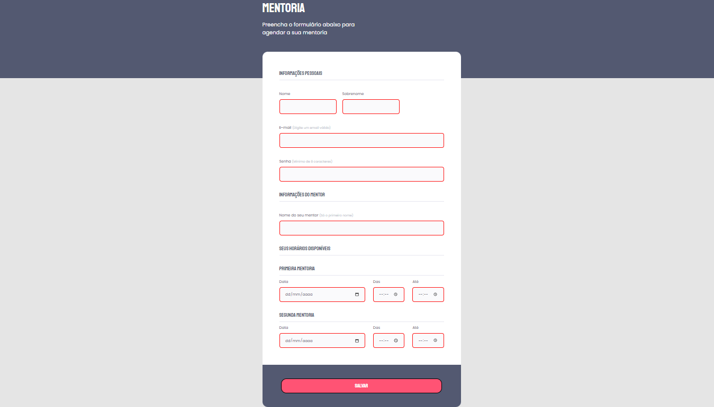

<h1 align="center"> 📑 Formulário para Mentorias </h1>

Esse projeto foi desenvolvido como parte de um desafio, no curso Explorer da Rocketseat, no Stage 03. Tinha como objetivo recriar um layout de um formulário.

 

  

 

[🔗 Clique aqui para acesar](https://lorenalopesm.github.io/formularioMentoria)

## 🛠 Atualizações feitas:

Implementei acessibilidades e o required, para indicar a necessidade do preenchimento correto.

## 🚀 Tecnologias

Esse projeto foi desenvolvido com as seguintes tecnologias:

- HTML 
- CSS
- Git e Github

## 💻 Projeto

Esse formulário tem o intuito de agendar mentorias.

## 🔖 Layout

Você pode visualizar o layout do projeto através [DESSE LINK](https://www.figma.com/file/0htizxUNciOQvIA7Ii4DxZ/Stage-03-Formul%C3%A1rio-intermedi%C3%A1rio-Copy?fuid=1151308321193220970). É necessário ter conta no [Figma](https://figma.com) para acessá-lo.

## ✉️ Contato
lore.lopees@outlook.com

------

